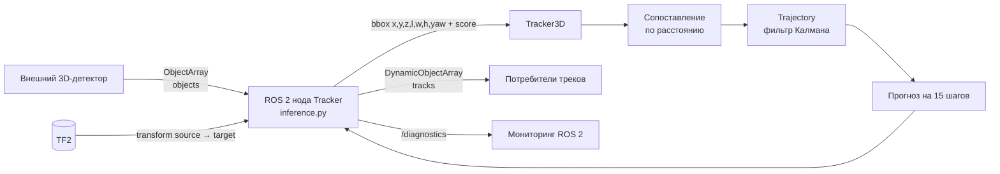
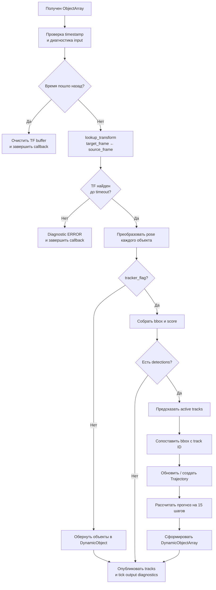

# tracker_prediction — передача проекта

`tracker_prediction` — ROS 2-пакет для online 3D multi-object tracking (MOT). Он получает результаты 3D-детектора, переводит их в единую TF-координатную систему, назначает постоянные ID, поддерживает траектории фильтром Калмана и публикует краткосрочный прогноз движения.

Пакет не выполняет детекцию сам: входные объекты должен публиковать внешний детектор (типовой сценарий — CenterPoint).

## Назначение и границы ответственности

На входе нода получает `objects_msgs/msg/ObjectArray` с 3D bounding boxes. На выходе публикует `objects_msgs/msg/DynamicObjectArray`:

- координаты каждого объекта преобразованы в `target_frame`;
- при включённом трекере каждому принятому объекту присвоен целочисленный `id`;
- для каждого опубликованного трека добавлены 15 прогнозных позиций;
- в `/diagnostics` доступны частота входа/выхода и состояние TF.

Не реализовано или не гарантируется пакетом:

- детекция, классификация и подготовка `ObjectArray`;
- сохранение треков между перезапусками;
- обработка кадра, в котором нет ни одной детекции (callback в этом случае не вызывает `Tracker3D.tracking`);
- измерение реального времени между кадрами: внутреннее время трекера — счётчик успешных кадров, а не `header.stamp`;
- настройка классов по отдельности: все объекты сопоставляются в одном пространстве, поле класса не используется.

## Архитектура



### Файлы и ответственность

| Путь | Назначение |
|---|---|
| `tracker_prediction/inference.py` | ROS 2-нода `Tracker`: подписка, TF2, конвертация сообщений, публикация и диагностика. |
| `tracker_prediction/tracker/tracker.py` | `Tracker3D`: жизненный цикл треков, сопоставление detection-to-track, прогноз и постобработка. |
| `tracker_prediction/tracker/trajectory.py` | `Trajectory`: модель состояния и шаги фильтра Калмана. |
| `tracker_prediction/tracker/object.py` | Контейнер состояния объекта на одном временном шаге. |
| `tracker_prediction/tracker/box_op.py` | Конвертация форматов bbox и перенос bbox в глобальную систему. |
| `tracker_prediction/tracker/config.py` | Загрузка и рекурсивное слияние YAML-конфигурации. |
| `tracker_prediction/config/online/*.yaml` | Профили параметров для разных детекторов. |
| `launch/tracker.launch.py` | Пример запуска с CenterPoint. |
| `setup.py` | Регистрация ROS 2 console script `tracker_node`. |

## Исполнение одного кадра



### Детали алгоритма

1. Перед обработкой детекций все активные траектории получают прогноз на текущий номер кадра. Траектория переносится в `dead_trajectories`, если пропущено `max_prediction_num` кадров; короткий неподтверждённый трек удаляется после `max_prediction_num_for_new_object` кадров.
2. Входной bbox имеет формат `[x, y, z, l, w, h, yaw]`. Для `Centerpoint`, `Waymo` и `OpenPCDet` формат принимается как есть. Для `Kitti` выполняется перестановка координат и размеров.
3. Для каждой detection рассчитывается евклидово расстояние до прогнозов активных треков по `x, y, z`, умноженное на `prediction_score` трека. Используется жадное сопоставление; пара принимается только при стоимости `< 2.0`. После выбора столбец трека блокируется, поэтому один трек не назначается двум detection в одном кадре.
4. Если пары нет, создаётся новый ID. Detection с `score <= init_score` вообще не создаёт трек. Для существующего трека обновление происходит только при `score > update_score`.
5. Состояние фильтра: `[x, y, z, vx, vy, vz, ax, ay, az, l, w, h, yaw]`. Модель движения — постоянное ускорение; матрица перехода строится из `LiDAR_scanning_frequency` и предполагает равный интервал между кадрами.
6. Для публикации прогноз строится на 15 внутренних шагов вперёд. В `DynamicObject.prediction` сохраняются `PoseStamped`, где используются `x`, `y`, `z` и yaw; размер bbox не прогнозируется в сообщении прогноза.

## ROS API

### Исполняемый файл

- Пакет: `tracker_prediction`
- Executable: `tracker_node`
- Python entry point: `tracker_prediction.inference:main`
- Имя ROS-ноды: `tracker_node`

### Топики

| Направление | Имя по умолчанию | Тип | Смысл |
|---|---|---|---|
| Subscribe | `objects` | `objects_msgs/msg/ObjectArray` | Детекции 3D-объектов. Требуется корректный `header.stamp` и `header.frame_id`. |
| Publish | `tracks` | `objects_msgs/msg/DynamicObjectArray` | Объекты в `target_frame`, ID и прогнозы при `tracker_flag=true`. |
| Publish | `/diagnostics` | `diagnostic_msgs/msg/DiagnosticArray` | Статус TF и частоты input/output, создаётся `diagnostic_updater`. |

В launch-файле эти имена переназначены:

| Локальное имя | Фактический топик |
|---|---|
| `objects` | `/centerpoint/objects3d` |
| `tracks` | `/tracking/tracking_objects` |

### Параметры ноды

| Параметр | Тип / default в коде | Значение |
|---|---|---|
| `tracker_flag` | `bool`, `false` | Включает присвоение ID, фильтр Калмана и прогноз. При `false` нода только применяет TF и публикует объекты без ID/прогноза. |
| `config` | `string`, `centerpoint_mot.yaml` | Путь к YAML с параметрами трекера. На практике нужно указывать абсолютный путь или путь, доступный из рабочей директории процесса. |
| `target_frame` | `string`, `hdl32` | Целевая координатная система. Для каждого входного `header.frame_id` должен быть доступен TF-переход в этот frame. |
| `timeout` | `float`, `0.3` с | Максимальное ожидание `lookup_transform`. |

> В `launch/tracker.launch.py` заданы другие значения: `target_frame=local_map`, `timeout=0.01`, `tracker_flag=true` и абсолютный путь автора к YAML. Этот путь необходимо заменить при развёртывании.

## Конфигурация трекера

Рабочий профиль для launch — `tracker_prediction/config/online/centerpoint_mot.yaml`.

| Ключ | Назначение | Влияние |
|---|---|---|
| `state_func_covariance` | Шум процесса `Q` | Больше значение — трекер сильнее допускает манёвры, но менее стабилен. |
| `measure_func_covariance` | Шум измерения `P` | Больше значение — меньше доверия текущей detection. |
| `prediction_score_decay` | Затухание доверия прогноза за шаг | Уменьшает шанс сопоставления с давно не обновлявшимся треком. |
| `LiDAR_scanning_frequency` | Расчётная частота LiDAR, Гц | Определяет `dt=1/f` в модели движения. Должна соответствовать реальному потоку. |
| `max_prediction_num` | Максимум кадров без обновления | После лимита активный трек переносится в архив. |
| `max_prediction_num_for_new_object` | Лимит для короткого неподтверждённого трека | Отбрасывает новый трек, если он не получил вторую detection за заданное число кадров. |
| `init_score` | Порог создания трека | Новый трек создаётся только при `score > init_score`. |
| `update_score` | Порог обновления существующего трека | Низкоскоринговая detection не обновляет существующий трек. |
| `post_score` | Порог постобработки | Используется при подготовке истории, но эта история сейчас не публикуется. На текущий выход `DynamicObjectArray` практически не влияет. |
| `latency` | Окно сглаживания, с | `0` — online-режим; отрицательное значение включает глобальную фильтрацию всей траектории. |

Ключи `dataset_path`, `detections_path`, `save_path`, `tracking_seqs`, `tracking_type`, `input_score` в репозитории присутствуют в части YAML, но в runtime ROS-ноды не используются.

## Установка и запуск

### Предпосылки

Нужны:

- ROS 2 с `rclpy`, `tf2_ros`, `geometry_msgs`, `diagnostic_msgs`, `diagnostic_updater`;
- пакет сообщений `objects_msgs` (определяет `ObjectArray`, `DynamicObjectArray`, `DynamicObject`);
- Python-пакеты: `numpy`, `scipy`, `PyYAML`, `easydict`;
- активный TF-граф между frame входного сообщения и `target_frame`.

Сборка из корня ROS 2 workspace:

```bash
colcon build --packages-select tracker_prediction
source install/setup.bash
```

Пример запуска без launch-файла (Linux/ROS 2):

```bash
ros2 run tracker_prediction tracker_node --ros-args \
  -p tracker_flag:=true \
  -p target_frame:=local_map \
  -p timeout:=0.1 \
  -p config:=/absolute/path/to/tracker_prediction/config/online/centerpoint_mot.yaml \
  -r objects:=/centerpoint/objects3d \
  -r tracks:=/tracking/tracking_objects
```

Или через launch после замены пути `config` в `launch/tracker.launch.py`:

```bash
ros2 launch tracker_prediction tracker.launch.py
```

### Проверка после запуска

```bash
ros2 node info /centerpoint/tracker_node
ros2 topic echo /tracking/tracking_objects --once
ros2 topic hz /centerpoint/objects3d
ros2 topic hz /tracking/tracking_objects
ros2 topic echo /diagnostics
ros2 run tf2_ros tf2_echo local_map <source_frame>
```

Имя ноды зависит от namespace launch: при приведённой конфигурации это `/centerpoint/tracker_node`.

## Формат данных и координаты

Для `ObjectArray.objects[*]` используются:

- `pose.position`: центр bbox `(x, y, z)`;
- `size`: `(length, width, height)`;
- `pose.orientation`: ориентация, из которой извлекается только yaw;
- `score`: уверенность детектора.

Перед трекингом `pose` объекта меняется in-place через TF. Выходной `DynamicObjectArray.header.frame_id` принудительно равен `target_frame`. Порядок компонентов bbox внутри трекера: `(x, y, z, length, width, height, yaw)`.

## Эксплуатация и диагностика

### Типовые неисправности

| Симптом | Вероятная причина | Действие |
|---|---|---|
| Нет выходных сообщений | Не приходит `objects` или TF недоступен в нужный timestamp | Проверить `ros2 topic hz`, `header.frame_id`, `tf2_echo` и `/diagnostics`. |
| В `/diagnostics` TF ERROR | Нет цепочки `<source_frame> → <target_frame>`, timestamp вне TF buffer или слишком малый `timeout` | Исправить TF publisher, увеличить `timeout`, сверить часы. |
| ID часто меняются | Объект смещается более чем на 2 м между кадрами, частота в YAML не соответствует потоку или низкий `prediction_score` | Настроить `LiDAR_scanning_frequency`, параметры фильтра; порог `2.0` сейчас зашит в `Tracker3D.association`. |
| Нет новых треков | `score <= init_score` | Уменьшить `init_score` или нормализовать шкалу confidence детектора. |
| Трек исчезает за препятствием | Превышен `max_prediction_num` | Увеличить лимит с учётом частоты и допустимого времени окклюзии. |
| Скачок или остановка после replay rosbag | Timestamp пошёл назад | Это штатная защита: TF buffer очищается, callback завершается. Отдельного сброса состояний трекера нет. |

### Наблюдаемость

`TopicDiagnostic` ожидает частоту входа и выхода в диапазоне 5–30 Гц и timestamp не старше 0.5 с. Диагностика полезна для обнаружения задержек, но сами границы не синхронизированы автоматически с `LiDAR_scanning_frequency` из YAML: при иной частоте их следует исправить в `inference.py`.

## Технический долг и риски передачи

Это фактические особенности текущего исходного кода, которые стоит закрыть перед эксплуатацией в критичном контуре.

1. `launch/tracker.launch.py` содержит жёстко заданный путь `/home/vlad/workspace/...`. После установки на другую машину launch не найдёт YAML. Следует разрешать конфиг через launch argument либо получать путь из package share directory.
2. В `package.xml` отсутствуют явные зависимости `tf2_ros`, `geometry_msgs`, `diagnostic_msgs`, а в `setup.py` — Python-зависимости `numpy`, `scipy`, `PyYAML`, `easydict`. Установка в чистой среде может не сработать без ручной установки.
3. YAML из `tracker_prediction/config/` не включены в `data_files` `setup.py` и не устанавливаются в package share directory. Поэтому путь к конфигурации должен пока указывать на исходный checkout; для штатной установки нужно добавить установку каталога `config`.
4. `CMakeLists.txt` пытается установить `tracker/inference.py`, хотя фактический файл — `tracker_prediction/inference.py`; при этом запуск обычно работает через `console_scripts` из `setup.py`. Сборочную схему нужно привести к одному варианту (`ament_python`).
5. Конфигурация хранится в глобальном объекте `cfg` и сливается мутирующим образом. В одном Python-процессе с несколькими нодами/повторной загрузкой параметры могут сохраняться между экземплярами.
6. Пустые кадры не передаются в ядро трекера, поэтому прогноз и счётчик пропусков не продвигаются. Это меняет ожидаемое поведение при временной потере всех detection.
7. Сопоставление жадное и использует фиксированный порог 2 м. Нет Hungarian assignment, IoU, class gating и коррекции углов yaw; на плотных сценах возможны ID switches.
8. Прогноз выдаётся на 15 кадров, а не секунд. Его фактический горизонт равен `15 / LiDAR_scanning_frequency` секунд.
9. `dead_trajectories` растёт без ограничений. Закомментированная очистка в `inference.py` не активна; в долгоживущем процессе надо ввести TTL/лимит или безопасную периодическую очистку.
10. Переменная `frame_first_dict` заполняется в callback, но далее не используется. Подготовка публикации истории траектории не завершена.
11. Тесты в `test/` — только стандартные ament lint-проверки. Unit/integration-тестов трекера, TF и ROS-интерфейса нет.

## Рекомендованный порядок доработок

1. Сделать воспроизводимый launch: launch arguments, путь через `get_package_share_directory`, конфиг без локальных путей.
2. Исправить и проверить зависимости/сборку в чистом ROS 2 workspace.
3. Добавить тестовые входные `ObjectArray` и unit-тесты для: ID на последовательных кадрах, пропусков detection, создания/удаления трека, TF error и backward time.
4. Измерить частоту и физический масштаб целевого сенсора; после этого настроить YAML и вынести association threshold в конфигурацию.
5. Если плотные сцены важны, заменить жадное сопоставление на глобальное с gating по расстоянию/IoU и, при наличии, class/features.

## Краткий чек-лист для принимающего инженера

- [ ] Внешний детектор публикует `ObjectArray` с правильными frame и timestamp.
- [ ] TF от входного frame к `target_frame` существует на timestamp сообщений.
- [ ] Абсолютный путь в launch заменён на переносимый.
- [ ] Выбран YAML, соответствующий частоте и шкале score конкретного детектора.
- [ ] `tracker_flag=true` в production launch.
- [ ] `ros2 topic echo` подтверждает ID и 15 `prediction` у трека.
- [ ] `/diagnostics` не содержит TF error и частоты соответствуют реальному потоку.
- [ ] Согласовано решение по очистке `dead_trajectories` для долгого запуска.
